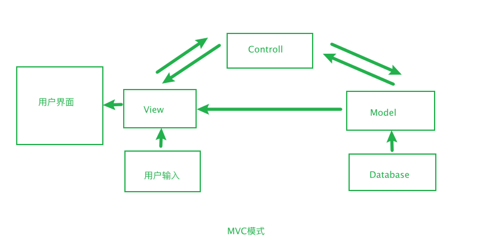
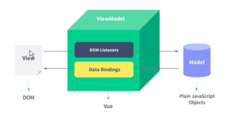

# 扩展

## 渐进式

渐进式表示你可以使用它的部分功能，也可以使用全部功能。

Vue的渐进式：🌞&nbsp;&nbsp;&nbsp;[vue-core](https://vuejs.org/) -> &nbsp;&nbsp;&nbsp;✈️&nbsp;&nbsp;&nbsp;[vue-router](https://router.vuejs.org/) -> &nbsp;&nbsp;&nbsp;📦 &nbsp;&nbsp;&nbsp;[vuex](https://vuex.vuejs.org/) -> &nbsp;&nbsp;&nbsp;🔧 &nbsp;&nbsp;&nbsp;[vue-cli](https://cli.vuejs.org/) 

## MVC与MVVM设计模式
在了解MVVM模式之前，我们先来看看什么是MVC模式

### MVC模式

#### 是什么？
**模型-视图-控制器(Model-View-Control, MVC)模式**。在Web还没有诞生前，MVC被应用于桌面程序中。在PHP、JSP等脚本语言诞生后，MVC逐渐成为Web开发的主流方式。在Web1.0时代被广泛应用于Web架构中。

**View视图层**是用户能够直接看到并可以进行交互的客户端界面，如桌面应用的图形界面、浏览器端渲染的网页。

**Model业务模型**用于计算、校验、处理和提供数据，但不直接与用户产生交互。

**Control控制器**负责收集用户输入的数据，向相关模型请求数据并返回相应的视图来完成交互请求。

#### 有什么好处？
实现了View与Model的分离，View专注于视图，而Model专注于数据，Control则在两者之间架起了一座桥梁。这样的设计不仅减少了Model层的冗余代码，使得View和Model更加易于维护，同时也简化了项目的架构和管理。

通过上面的介绍，我想大家对MVC模式有一定的了解了，现在我们就一起来聊聊MVVM模式。

### MVVM模式
**模型-视图-视图模型(Model-View-ViewMdel, MVVM)模式**。和MVC一样,也解耦了视图(View)和模型(Model)，ViewModel层封装了界面展示和操作属性的方法。通过数据绑定，我们可以将View和ViewModel关联在一起，当ViewModel中的数据发生变化时，View也会进行同步的更新。

### 区别
MVC是系统架构级别的，而MVVM是用于单页面上，因此MVVM的灵活性要远大于MVC，如果将M抛开，只看MVVM的话，那这就是一个组件(如treeview)的设计模式。所以， MVVM模式是组件化开发的最佳实践。
